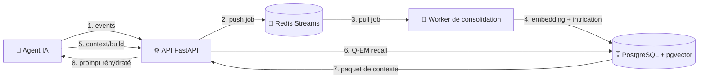

<!-- ╔══════════════════════════════════════════════════════════════╗ -->
<!-- ║                          SYNAPTIQ                              ║ -->
<!-- ╚══════════════════════════════════════════════════════════════╝ -->

<div align="center">

<h1>🧠 SynaptiQ</h1>

<h3><em>Le second cerveau vectoriel des agents IA — mémoire à long terme, sémantique et temporelle.</em></h3>

<p>
  <strong>Q-EM</strong> · <em>Quantum-like Entanglement Memory</em> — une mémoire qui relie les souvenirs par le <strong>sens</strong>, pas par des liens écrits à la main.
</p>

<p>
  <a href="https://github.com/Jimmyjoe13/synaptiq/actions/workflows/ci.yml"></a>
  
  
  
  
  
  
  
  
</p>

<p>
  <a href="#-pourquoi-q-em">Pourquoi Q-EM</a> ·
  <a href="#-fonctionnalités-clés">Fonctionnalités</a> ·
  <a href="#-architecture">Architecture</a> ·
  <a href="#-démarrage-rapide">Démarrage</a> ·
  <a href="#-le-moteur-q-em-en-4-phases">Le moteur Q-EM</a> ·
  <a href="#-sdk-python">SDK</a> ·
  <a href="#-api">API</a> ·
  <a href="#-sécurité">Sécurité</a>
</p>

</div>

---

**SynaptiQ** est une infrastructure de mémoire à long terme (LTM) pour agents IA autonomes. Au lieu d'un RAG « top-k plat » qui ressort les 5 chunks les plus proches, SynaptiQ **consolide** le flux d'expérience de l'agent, **relie** les souvenirs par intrication sémantique, **élague** les contradictions et les redondances, puis **assemble** un paquet de contexte compact taillé pour ton budget de tokens.

> [!NOTE]
> **Auto-hébergé : 1 déploiement = 1 client.** Le périmètre (tenant) est décidé côté serveur, jamais transmis dans l'appel. Tu gardes tes données chez toi ; l'agent, lui, gagne une mémoire qui apprend de ses erreurs.

<br>

## 💡 Pourquoi Q-EM

Un RAG classique répond à *« qu'est-ce qui ressemble à ma requête ? »*. Q-EM répond à *« de quoi l'agent a réellement besoin, maintenant, pour agir sans se répéter ? »*.

| | 🗂️ RAG classique | 🧠 SynaptiQ (Q-EM) |
|---|:---|:---|
| **Unité stockée** | Chunks de documents | Souvenirs consolidés (fait, préférence, règle, erreur…) |
| **Sélection** | Top-k similarité cosinus | Superposition → **intrication** → interférence → mesure |
| **Souvenirs liés** | Ignorés s'ils ne matchent pas la requête | **Ramenés par activation** le long des liens `entangled_with` |
| **Contradictions** | Ressorties telles quelles | **Filtrées** (la version obsolète est annulée) |
| **Redondances** | Occupent le contexte | **Élaguées** (cosinus > seuil → une seule survit) |
| **Temporalité** | Absente | **Décroissance** configurable (demi-vie) |
| **Sortie** | Liste de chunks | **Paquet structuré** sous budget de tokens (facts, préférences, règles, erreurs…) |

> [!IMPORTANT]
> Le **benchmark chiffré Q-EM vs RAG** est sur la roadmap. Le tableau ci-dessus décrit des **différences de conception**, pas des mesures de performance.

<br>

## ⚡ Fonctionnalités clés

**🧠 Moteur mémoire**
- 🌌 **Q-EM** — superposition sémantique, intrication conceptuelle, interférence destructive, collapse par densité d'utilité/token.
- 🔗 **Intrication automatique** — le worker crée les liens `entangled_with` / `supersedes_by` / `contradicts` sans intervention manuelle.
- ⏳ **Décroissance temporelle** — les souvenirs non ré-accédés perdent en pertinence (demi-vie configurable), réactivés à chaque accès.
- 🗃️ **Collections logiques** — routage automatique par `type`/`subtype` : faits, préférences, règles, bonnes pratiques, résolutions d'erreurs, épisodes.

**🛰️ Pipeline & fiabilité**
- 📡 **Capture asynchrone** — Redis Streams (consumer group, ACK, retry borné, dead-letter queue) : zéro latence côté agent.
- 🧩 **Extraction LLM structurée** — classification des souvenirs en JSON validé, avec fallback regex.
- 🪪 **Idempotence** — `idempotency_key` : deux fois le même événement = un seul souvenir.
- 🏊 **Pool de connexions** PostgreSQL, index **HNSW** sur les embeddings.

**🔌 Intégration**
- 🐍 **SDK Python** prêt à l'emploi.
- 🧰 **Serveur MCP** — les mêmes capacités exposées comme outils à Claude Desktop, Cursor, et tout client MCP.
- 🧬 **Embedder pluggable** — LM Studio (local) par défaut, OpenAI / OpenRouter / NVIDIA NIM au besoin.

**🔐 Sécurité**
- 🏰 **Isolation multi-tenant** décidée côté serveur, auth par clé API optionnelle, rate limiting, CORS, **purge RGPD**.

<br>

## 🏗️ Architecture

Architecture modulaire asynchrone : l'agent n'attend jamais un traitement lourd, tout est déporté sur le worker.



| Composant | Rôle |
|---|---|
| **API** (`apps/api`) | Ingestion (`/events`), recall (`/context/build`, `/retrieve`), écriture directe (`/memories`). |
| **Worker** (`apps/worker`) | Consomme le stream, classe → embed → intrique les souvenirs. |
| **Core** (`packages/core`) | Logique partagée : `Embedder` pluggable, gouvernance, cœur Q-EM pur. |
| **SDK** (`packages/sdk-python`) | Client Python. |
| **MCP** (`apps/mcp`) | Outils exposés aux agents via Model Context Protocol. |

<br>

## 🚀 Démarrage rapide

### Prérequis
- **Docker** & Docker Compose
- **LM Studio** avec un modèle d'embedding chargé et le serveur local sur `:1234` (voir [Embeddings](#-embeddings))
- Python **3.11+** (dev hors conteneur uniquement)

### Option A — Stack complète en Docker (recommandé)

```bash
git clone https://github.com/Jimmyjoe13/synaptiq.git
cd synaptiq
cp .env.example .env          # ajuste EMBEDDING_MODEL au nom exact affiché par LM Studio
docker compose up --build     # Postgres + Redis + API + Worker + MCP
```

Quand `synaptiq-api` est `healthy` :

```bash
curl http://127.0.0.1:8000/health   # -> {"status":"ok", ...}
```

| Service | URL |
|---|---|
| API | `http://127.0.0.1:8000` |
| MCP (SSE) | `http://127.0.0.1:8765` |
| PostgreSQL | `127.0.0.1:5435` |
| Redis | `127.0.0.1:6399` |

> [!TIP]
> Depuis un conteneur, LM Studio est joignable via `host.docker.internal:1234` (déjà configuré dans `docker-compose.yml`).

<details>
<summary><strong>Option B — Dev local (hors conteneur)</strong></summary>

<br>

```bash
# 1. Infra de données uniquement
docker compose up -d postgres redis

# 2. Dépendances
pip install -r requirements-dev.txt
pip install -e packages/core -e packages/sdk-python

# 3. API (port 8000)
python -m uvicorn apps.api.main:app --reload --port 8000

# 4. Worker de consolidation (autre terminal)
python apps/worker/worker.py
```

En local, `EMBEDDING_BASE_URL` pointe vers `http://localhost:1234/v1` (défaut de `.env.example`).

</details>

<br>

## 🌌 Le moteur Q-EM en 4 phases

Une métaphore quantique, une mécanique déterministe. À chaque `/context/build` :

```
  1. SUPERPOSITION      Recherche vectorielle (pgvector) → candidats scorés
        │               score = similarité × facteur_de_récence
        ▼
  2. INTRICATION        Propagation d'activation amortie le long des liens
        │               'entangled_with' → des souvenirs liés remontent
        ▼               même sans matcher la requête
  3. INTERFÉRENCE       Filtrage destructif :
        │                 • contradictions → la version obsolète est annulée
        ▼                 • redondances (cosinus > seuil) → une seule survit
  4. MESURE             Collapse glouton par densité d'utilité/token,
                        routé vers les 7 collections du paquet de contexte
```

Le cœur algorithmique vit dans `packages/core/synaptiq_core/qem.py` — **fonctions pures, sans I/O, entièrement testées unitairement**. Les seuils sont externalisés en variables d'environnement (`QEM_ENTANGLE_DAMPING`, `QEM_REDUNDANCY_THRESHOLD`, `QEM_RECENCY_HALFLIFE_DAYS`).

<br>

## 🐍 SDK Python

```python
from synaptiq_sdk import SynaptiqClient

# api_key optionnelle : requise seulement si SYNAPTIQ_AUTH_REQUIRED=true
client = SynaptiqClient("http://127.0.0.1:8000", api_key=None)

# 1. Capturer une interaction (classée et consolidée en asynchrone par le worker)
client.capture(
    agent_id="george", session_id="sess_1",
    content="L'utilisateur préfère des rapports courts en français.",
)

# 2. Réhydrater un contexte compact avant d'appeler le LLM
ctx = client.build_context(
    agent_id="george", session_id="sess_1",
    task="Rédiger un rapport de suivi",
    query="préférences de style et de format",
)

packet = ctx["context_packet"]                 # facts / preferences / rules / errors / ...
print(ctx["token_estimate"], packet["preferences"])
```

<br>

## 📡 API

| Méthode | Endpoint | Rôle |
|:---:|---|---|
| `GET` | `/health` | État Postgres + Redis |
| `POST` | `/events` | Capture d'un événement brut (async, idempotent) |
| `POST` | `/memories` | Écriture directe d'un souvenir consolidé |
| `POST` | `/retrieve` | Recherche sémantique vectorielle (pgvector) |
| `POST` | `/context/build` | Assemblage du paquet de contexte Q-EM sous budget de tokens |
| `DELETE` | `/memories` | Purge RGPD (filtre optionnel `?agent_id=`) |

Le **serveur MCP** expose les mêmes capacités comme outils (`store_memory`, `recall_memories`, `build_context`) pour tout client MCP.

<details>
<summary><strong>Collections logiques (type / subtype)</strong></summary>

<br>

Il n'existe pas de table « collection » : une collection = un regroupement par `type`/`subtype`, routé automatiquement dans le paquet de contexte.

| `type` | `subtype` | Clé du paquet |
|---|---|---|
| `semantic` | `preference` | `preferences` |
| `semantic` | `fact` | `facts` |
| `procedural` | `coding_best_practices` | `best_practices` |
| `procedural` | `code_error_resolution` | `errors` |
| `procedural` | *(autre)* | `rules` |
| `episodic` | `interaction` | `episodes` |
| `working` | — | `examples` |

</details>

<br>

## 🧬 Embeddings

Fournisseur configurable via `EMBEDDING_PROVIDER` (`lmstudio` par défaut). La dimension du schéma est `VECTOR(384)`.

> [!IMPORTANT]
> `all-MiniLM-L6-v2` est optimisé pour l'**anglais** : le ranking de contenu **francophone** abstrait est médiocre. Pour du FR, utilise un modèle multilingue **384-dim** comme **`paraphrase-multilingual-MiniLM-L12-v2`** — meilleur ranking, **aucune migration de schéma** (même dimension).

Le mock déterministe (`EMBEDDING_PROVIDER=mock`) est réservé aux tests.

<br>

## 🔐 Sécurité

SynaptiQ est **auto-hébergé : un déploiement = un périmètre**. Le tenant est fixé côté serveur (`SYNAPTIQ_TENANT`, défaut `default`) et **jamais** transmis par l'appelant — impossible de lire/écrire un autre périmètre en trafiquant le corps de la requête. La séparation entre agents d'une même instance se fait via `agent_id`.

> [!CAUTION]
> `SYNAPTIQ_AUTH_REQUIRED=false` (défaut) convient à une instance de confiance (localhost / réseau interne). **Si l'API est exposée sur Internet, passe à `true`** — sinon l'instance est ouverte en lecture/écriture.

```bash
# Créer une clé (la clé en clair n'est affichée qu'une seule fois)
python scripts/create_api_key.py --name "agent-prod"
# Puis envoyer :  Authorization: Bearer <clé>
```

Les origines CORS d'un front navigateur se déclarent explicitement dans `CORS_ORIGINS` (vide par défaut ; le SDK/MCP server-à-serveur n'est pas concerné).

<br>

## 🧪 Tests & CI

```bash
# Unitaires (sans infra, embeddings mockés)
pytest tests/unit

# Intégration (nécessitent Postgres + Redis)
docker compose up -d postgres redis
EMBEDDING_PROVIDER=mock pytest -m integration
```

La CI (`.github/workflows/ci.yml`) exécute ruff + tests unitaires, plus l'intégration sur des services Postgres/Redis éphémères.

<br>

## 🗺️ Roadmap

<details>
<summary><strong>Voir la feuille de route</strong></summary>

<br>

- [ ] 📊 **Benchmark Q-EM vs RAG classique** (preuve de valeur chiffrée)
- [ ] 📦 **SDK JavaScript/TypeScript** + adaptateurs LangChain / CrewAI
- [ ] 📈 **Métriques & tracing** (observabilité du recall)
- [ ] 🌍 **Modèle d'embedding multilingue par défaut** dans `.env.example`
- [ ] 🛠️ Outillage : ruff élargi, `mypy`, `pre-commit`

</details>

<br>

---

<div align="center">

**Licence MIT** — voir [`LICENSE`](LICENSE).

<sub>Construit pour les agents qui n'ont pas le droit d'oublier. 🧠</sub>

</div>
