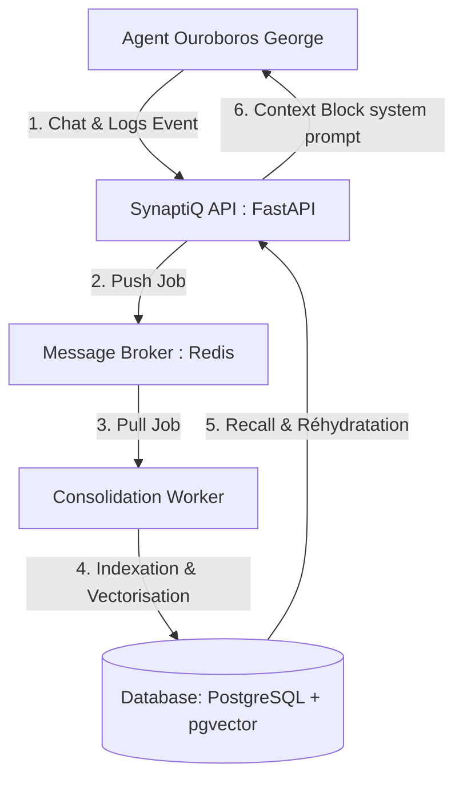

# SynaptiQ 🧠💫

> **Second Cerveau Sémantique et Temporel pour Agents IA Autonomes**

SynaptiQ est une infrastructure de mémoire à long terme (LTM) avancée conçue spécifiquement pour les agents IA autonomes (comme Ouroboros George). Il s'agit d'une alternative ultra-performante aux outils de gestion de connaissances traditionnels (Obsidian, Mempalace) qui repose sur l'indexation vectorielle sémantique et des processus d'intrication conceptuelle (**Quantum-like Entanglement Memory - Q-EM**).

---

## 🌌 Vision & Philosophie

Contrairement aux outils de prise de notes humains qui imposent des arborescences ou des liens markdown rigides créés à la main, **SynaptiQ** permet aux agents IA d'auto-indexer leur flux d'expérience de manière multidimensionnelle. 

Grâce à l'intrication vectorielle sémantique, l'agent peut faire des analogies non-linéaires en reliant des expériences distantes dans le temps mais connectées par le sens, ce qui lui évite de répéter ses erreurs et augmente sa pertinence décisionnelle en production.

---

## 🏗️ Architecture du Système

SynaptiQ est conçu avec une architecture modulaire asynchrone pour garantir une exécution sans aucune latence lors des appels de l'agent principal :



1. **SynaptiQ API (FastAPI - Port 8000) :** Reçoit les événements de chat (`/events`) et fournit dynamiquement le contexte de prompt réhydraté (`/context/build`).
2. **Message Broker (Redis) :** File d'attente asynchrone de traitement des souvenirs pour isoler l'agent de tout traitement lourd.
3. **Consolidation Worker (Python) :** Consomme le stream Redis (consumer group + ACK + DLQ), calcule les embeddings via un fournisseur pluggable (LM Studio par défaut), et crée les associations d'intrication dans la base de données.
4. **Base de Données (PostgreSQL & pgvector) :** Stockage hybride relationnel (métadonnées, logs d'outils, chronologie) et vectoriel (embeddings sémantiques).

---

## ⚡ Fonctionnalités Clés

* **Recherche sémantique réelle :** embeddings vectoriels via une interface `Embedder` pluggable (LM Studio en local par défaut ; OpenAI / OpenRouter / NVIDIA NIM au besoin), recherche par similarité cosinus pgvector.
* **Dynamic Context Rehydration (Q-EM) :** assemblage d'un paquet de contexte compact sous budget de tokens (superposition → intrication → interférence → mesure), injecté dans le prompt système.
* **Intrication Conceptuelle (Q-EM) :** cartographie et liaison de souvenirs reliés par le sens (`entangled_with`, `supersedes_by`, `contradicts`).
* **Pipeline fiable :** capture asynchrone via Redis Streams (consumer group, ACK, retry borné, dead-letter queue), pool de connexions PostgreSQL, idempotence des événements.
* **Sécurité multi-tenant :** authentification par clé API, isolation stricte par tenant, rate limiting, CORS, purge RGPD.

---

## 🚀 Installation et Démarrage Local

### Prérequis
* Docker & Docker Compose
* **LM Studio** lancé sur l'hôte, avec un modèle d'embedding chargé (`all-MiniLM-L6-v2`) et le serveur local démarré (port `1234`). SynaptiQ y accède pour vectoriser les souvenirs.
* Python 3.12+ (uniquement pour le dev hors-conteneur)

### Option A — Stack complète en Docker (recommandé)

```bash
git clone https://github.com/Jimmyjoe13/synaptiq.git
cd synaptiq
cp .env.example .env        # ajuster EMBEDDING_MODEL au nom exact affiché par LM Studio
docker compose up --build   # Postgres + Redis + API + Worker + MCP
```

La stack démarre avec des healthchecks et un ordre de dépendance (`depends_on`). Une fois `synaptiq-api` en état `healthy` :

```bash
curl http://127.0.0.1:8000/health   # -> {"status":"ok", ...}
```

Services exposés : API `http://127.0.0.1:8000`, MCP (SSE) `http://127.0.0.1:8765`, Postgres `5435`, Redis `6399`.

> Depuis un conteneur, LM Studio est joignable via `host.docker.internal:1234` (déjà configuré dans `docker-compose.yml`).

### Option B — Dev local (hors conteneur)

```bash
# 1. Infra de données uniquement
docker compose up -d postgres redis

# 2. Dépendances Python
pip install -r requirements-dev.txt

# 3. API (port 8000)
python -m uvicorn apps.api.main:app --reload --port 8000

# 4. Worker de consolidation (dans un autre terminal)
python apps/worker/worker.py
```

En local, `EMBEDDING_BASE_URL` pointe vers `http://localhost:1234/v1` (valeur par défaut de `.env.example`).

---

## 🔌 Exemple d'Intégration dans un Agent (SDK Python)

```python
from synaptiq_sdk import SynaptiqClient

# api_key optionnelle : requise seulement si SYNAPTIQ_AUTH_REQUIRED=true
client = SynaptiqClient("http://127.0.0.1:8000", api_key=None)

# 1. Capturer une interaction (classée et consolidée en asynchrone par le worker)
client.capture(
    tenant_id="org_01", agent_id="george", session_id="sess_1",
    content="L'utilisateur préfère des rapports courts en français.",
)

# 2. Réhydrater un contexte compact avant d'appeler le LLM
ctx = client.build_context(
    tenant_id="org_01", agent_id="george", session_id="sess_1",
    task="Rédiger un rapport de suivi",
    query="préférences de style et de format",
)
packet = ctx["context_packet"]          # facts / preferences / episodes / rules / ...
print(ctx["token_estimate"], packet["preferences"])
```

---

## 📡 Endpoints principaux

| Méthode | Endpoint | Rôle |
|---|---|---|
| GET | `/health` | État Postgres + Redis |
| POST | `/events` | Capture d'un événement brut (async, idempotent via `idempotency_key`) |
| POST | `/memories` | Écriture directe d'un souvenir consolidé |
| POST | `/retrieve` | Recherche sémantique vectorielle (pgvector) |
| POST | `/context/build` | Assemblage du paquet de contexte Q-EM sous budget de tokens |
| DELETE | `/memories?tenant_id=` | Purge RGPD scopée au tenant |

Le serveur MCP expose les mêmes capacités comme outils (`store_memory`, `recall_memories`, `build_context`) pour tout client MCP (Claude Desktop, Cursor…).

---

## 🔑 Sécurité & Multi-tenant

L'auth par clé API est optionnelle (`SYNAPTIQ_AUTH_REQUIRED=false` par défaut, mode dev). Pour l'activer :

```bash
# Créer une clé pour un tenant (la clé en clair n'est affichée qu'une seule fois)
python scripts/create_api_key.py --tenant org_01 --name "agent-prod"
# Puis passer SYNAPTIQ_AUTH_REQUIRED=true et envoyer :  Authorization: Bearer <clé>
```

Chaque clé est scopée à un tenant : impossible de lire/écrire les données d'un autre tenant, même en trafiquant le corps de la requête.

---

## 🧠 Embeddings

Fournisseur configurable via `EMBEDDING_PROVIDER` (`lmstudio` par défaut). `all-MiniLM-L6-v2` est optimisé pour l'**anglais** ; pour du contenu majoritairement **francophone**, un modèle multilingue 384-dim (ex. `paraphrase-multilingual-MiniLM-L12-v2`) donne de meilleurs résultats — aucun changement de schéma requis (même dimension). Le mock déterministe (`EMBEDDING_PROVIDER=mock`) est réservé aux tests.

---

## 🧪 Tests & CI

```bash
# Tests unitaires (sans infra, embeddings mockés)
pytest tests/unit

# Tests d'intégration (nécessitent Postgres + Redis)
docker compose up -d postgres redis
EMBEDDING_PROVIDER=mock pytest -m integration
```

La CI GitHub Actions (`.github/workflows/ci.yml`) exécute ruff + tests unitaires, plus les tests d'intégration sur des services Postgres/Redis éphémères.

---

## 📄 Licence
Ce projet est sous licence MIT. Pour plus d'informations, veuillez consulter le fichier `LICENSE`.
