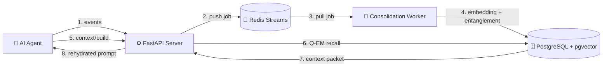

<!-- ╔══════════════════════════════════════════════════════════════╗ -->
<!-- ║                          SYNAPTIQ                              ║ -->
<!-- ╚══════════════════════════════════════════════════════════════╝ -->

<div align="center">

<br>

<br><br>

<h1>SynaptiQ</h1>

<h3><em>The vector second brain for AI agents — long-term, semantic, and temporal memory.</em></h3>

<p>
  <strong>Q-EM</strong> · <em>Quantum-like Entanglement Memory</em> — a memory engine that connects memories by <strong>meaning</strong>, not manually written wikilinks.
</p>

<p>
  <a href="https://github.com/Jimmyjoe13/synaptiq/actions/workflows/ci.yml"></a>
  
  
  
  
  
  
  
  
</p>

<p>
  <a href="#-why-q-em">Why Q-EM</a> ·
  <a href="#-key-features">Key Features</a> ·
  <a href="#-architecture">Architecture</a> ·
  <a href="#-quickstart">Quickstart</a> ·
  <a href="#-the-q-em-engine-in-4-phases">Q-EM Engine</a> ·
  <a href="#-sdk">SDKs</a> ·
  <a href="#-api-v1">API</a> ·
  <a href="#-security">Security</a>
</p>

</div>

---

**SynaptiQ** is a production-grade Long-Term Memory (LTM) infrastructure for autonomous AI agents. Unlike standard "flat top-k" RAG systems that simply retrieve the 5 nearest raw document chunks, SynaptiQ **consolidates** the agent's stream of experience, **entangles** memories semantically, **prunes** contradictions and redundancies, and **assembles** a compact context packet perfectly tailored to your token budget.

> [!NOTE]
> **Self-hosted: 1 deployment = 1 security perimeter.** The tenant boundary is enforced server-side and never trusted from request payloads. Keep your data on-premise while giving your agents a memory that learns from its mistakes.

<br>

## 💡 Why Q-EM

Standard RAG answers: *"Which chunks look similar to my query text?"*  
Q-EM answers: *"What exact context does the agent actually need right now to act without repeating itself?"*

| Feature / Dimension | 🗂️ Standard RAG | 🧠 SynaptiQ (Q-EM) |
|---|:---|:---|
| **Stored Unit** | Raw document chunks | Consolidated memories (facts, preferences, rules, errors…) |
| **Selection Algorithm** | Top-k cosine similarity | Superposition → **entanglement** → interference → measurement |
| **Related Memories** | Ignored if they don't match query text | **Retrieved via activation** along `entangled_with` graph edges |
| **Contradictions** | Returned side-by-side | **Filtered out** (obsolete versions are superseded) |
| **Redundancies** | Fill up context budget | **Pruned** (cosine > threshold → only one survives) |
| **Temporality** | Missing or naive | Configurable **temporal decay** (half-life, recency boost) |
| **Output** | Unstructured list of chunks | **Structured packet** under token budget (facts, preferences, rules, errors…) |

<br>

### 📊 LOCOMO Benchmark (Proof of Value vs Vector Baseline)

Validated on the benchmark dataset **LOCOMO** (419 dialogue turns, 152 evaluated questions, fixed context budget of 1500 tokens):

| Question Category | Standard Vector Baseline (Top-k) | 🧠 SynaptiQ (Q-EM) | Net Gain (Q-EM) |
|:---|:---:|:---:|:---:|
| **Overall Accuracy** | 48.03 % | **51.32 %** 🥇 | **+3.29 pts (+3.3 %)** |
| **Multi-Hop Questions** (Graph Entanglement) | 18.75 % | **25.00 %** 🥇 | **+6.25 pts** |
| **Temporal Reasoning** (Timestamping) | 78.38 % | **83.78 %** 🥇 | **+5.40 pts** |
| **Single-Hop Questions** | 47.14 % | **52.86 %** 🥇 | **+5.72 pts** |

* 🔗 **1,420 entanglement relations** automatically generated by the background worker.
* 🛡️ **0.0% degraded extractions** (100% valid structured LLM memory extractions).

<br>

### ⚔️ SynaptiQ Q-EM vs Obsidian MCP (Static Markdown Search)

Comparative evaluation on knowledge evolution & contradiction resolution scenarios:

| Test / Scenario | 📝 Obsidian MCP (Markdown Notes) | 🧠 SynaptiQ (Q-EM) | Analysis & Victory |
|:---|:---:|:---:|:---|
| **DB Migration Contradiction** | ❌ Failed (0/1) | **✅ Passed (1/1)** 🥇 | Obsidian keeps MySQL & Postgres; SynaptiQ supersedes MySQL (`supersedes_by`). |
| **Style & Tone Rule Update** | ❌ Failed (0/1) | **✅ Passed (1/1)** 🥇 | Obsidian outputs contradictory advice; SynaptiQ filters out obsolete rules. |
| **Contradiction Resolution Rate** | **0.0 %** | **100.0 %** 🥇 | **Absolute supremacy of SynaptiQ on continuous learning.** |

<br>

## ⚡ Key Features

**🧠 Memory Engine**
- 🌌 **Q-EM Core** — semantic superposition, concept entanglement, destructive interference, greedy collapse by utility density.
- 🔗 **Automatic Entanglement** — worker automatically builds `entangled_with`, `supersedes_by`, and `contradicts` edges.
- ⏳ **Temporal Decay** — unaccessed memories decay over time (configurable half-life) and reactivate upon retrieval.
- 🗃️ **Logical Collections** — automatic routing by `type`/`subtype`: facts, preferences, rules, coding best practices, error resolutions, episodes.

**🛰️ Pipeline & Reliability**
- 📡 **Asynchronous Ingestion** — Redis Streams (consumer groups, ACK, bounded retries, dead-letter queue): zero latency for the calling agent.
- 🧩 **Structured LLM Extraction** — memory classification into validated JSON schemas, with regex fallback heuristics.
- 🪪 **Idempotency** — `idempotency_key`: submitting the same event twice results in a single consolidated memory.
- 🏊 **PostgreSQL Connection Pooling** & **HNSW Indexing** for ultra-fast vector search.

**🔌 Integrations**
- 🐍 **Python SDK** (`synaptiq-sdk`) & 🟦 **TypeScript SDK** (`@synaptiq/sdk`) out of the box.
- 🧰 **MCP Server** — native FastMCP tools (`store_memory`, `recall_memories`, `build_context`) for Claude Desktop, Cursor, and any MCP client.
- 🧬 **Pluggable Embeddings** — LM Studio (local) by default, OpenRouter, OpenAI, or NVIDIA NIM on demand.

**🔐 Security**
- 🏰 **Multi-Tenant Isolation** enforced server-side, Bearer API key authentication, rate limiting, CORS configuration, **GDPR purge endpoint**.

<br>

## 🏗️ Architecture

Modular async architecture: the agent never waits for heavy processing, all extraction and graph building is offloaded to background workers.


```mermaid
graph LR
    A[🤖 AI Agent] -->|1. events| API[⚙️ FastAPI Server]
    API -->|2. push job| R[(📨 Redis Streams)]
    R -->|3. pull job| W[🧠 Consolidation Worker]
    W -->|4. embedding + entanglement| DB[(🗄️ PostgreSQL + pgvector)]
    A -->|5. context/build| API
    API -->|6. Q-EM recall| DB
    DB -->|7. context packet| API
    API -->|8. rehydrated prompt| A
```

| Component | Role |
|---|---|
| **API** (`apps/api`) | Event ingestion (`/events`), context assembly (`/context/build`, `/retrieve`), direct memory writing (`/memories`). |
| **Worker** (`apps/worker`) | Consumes stream, classifies → embeds → entangles memories in graph. |
| **Core** (`packages/core`) | Shared logic: pluggable `Embedder`, governance, pure Q-EM mathematical engine. |
| **SDKs** (`packages/sdk-python`, `packages/sdk-typescript`) | Native client libraries for Python & TypeScript/JavaScript. |
| **MCP** (`apps/mcp`) | Exposed tools for AI agents via Model Context Protocol (`stdio` & `http`). |

<br>

## 🚀 Quickstart

### Prerequisites
- **Docker** & Docker Compose
- **LM Studio** (local) or an **OpenRouter / OpenAI API Key** (see [Embeddings](#-embeddings))
- Python **3.11+** (for non-container local development)

### Option A — Full Stack via Docker (Recommended)

```bash
git clone https://github.com/Jimmyjoe13/synaptiq.git
cd synaptiq
cp .env.example .env          # Adjust EMBEDDING_PROVIDER & API keys as needed
docker compose up --build     # Starts Postgres + Redis + API + Worker + MCP
```

Once `synaptiq-api` reports `healthy`:

```bash
curl http://127.0.0.1:8000/v1/health   # -> {"status":"ok", ...}
```

| Service | Endpoint |
|---|---|
| API (`v1`) | `http://127.0.0.1:8000` |
| MCP (SSE) | `http://127.0.0.1:8765` |
| PostgreSQL | `127.0.0.1:5435` |
| Redis | `127.0.0.1:6399` |

<details>
<summary><strong>Option B — Local Dev (Without Docker Containers for Python)</strong></summary>

<br>

```bash
# 1. Start database infrastructure only
docker compose up -d postgres redis

# 2. Install dependencies
pip install -r requirements-dev.txt
pip install -e packages/core -e packages/sdk-python

# 3. Start FastAPI server (port 8000)
python -m uvicorn apps.api.main:app --reload --port 8000

# 4. Start Consolidation Worker (separate terminal)
python apps/worker/worker.py
```

</details>

<br>

## 🌌 The Q-EM Engine in 4 Phases

A quantum-inspired metaphor, a deterministic algorithmic pipeline. On every `/v1/context/build`:

```
  1. SUPERPOSITION      Vector similarity search (pgvector) → scored memory candidates
        │               score = cosine_similarity × recency_factor
        ▼
  2. ENTANGLEMENT       Damped activation spreading along 'entangled_with' graph edges
        │               → related memories surface even if they don't match query keywords
        ▼
  3. INTERFERENCE       Destructive filtering:
        │                 • contradictions → obsolete versions are superseded
        ▼                 • redundancies (cosine > threshold) → only one survives
  4. MEASUREMENT        Greedy collapse by utility density per token,
                        routed into the 7 context packet collections
```

The algorithmic core lives in `packages/core/synaptiq_core/qem.py` — **pure functions, zero I/O, 100% unit tested**.

<br>

## 🐍 SDK Usage

### Python (`synaptiq-sdk`)

```python
from synaptiq_sdk import SynaptiqClient

client = SynaptiqClient("http://127.0.0.1:8000", api_key="your_api_key")

# 1. Capture raw agent interaction (async consolidation by worker)
client.capture(
    agent_id="george",
    session_id="sess_1",
    content="User prefers concise progress reports in English.",
)

# 2. Rehydrate compact context packet before calling LLM
ctx = client.build_context(
    agent_id="george",
    session_id="sess_1",
    task="Draft weekly status update",
    query="format and language preferences",
)

packet = ctx["context_packet"]                 # facts / preferences / rules / errors...
print(ctx["token_estimate"], packet["preferences"])
```

### TypeScript (`@synaptiq/sdk`)

```typescript
import { SynaptiqClient } from "@synaptiq/sdk";

const client = new SynaptiqClient({
  baseUrl: "http://127.0.0.1:8000",
  apiKey: "your_api_key",
});

await client.capture({
  agentId: "george",
  sessionId: "sess_1",
  content: "User prefers concise progress reports in English.",
});

const ctx = await client.buildContext({
  agentId: "george",
  sessionId: "sess_1",
  task: "Draft weekly status update",
  query: "format and language preferences",
});
```

<br>

## 📡 API Reference (`/v1`)

| Method | Endpoint | Role |
|:---:|---|---|
| `GET` | `/v1/health` | Service health status (Postgres + Redis) |
| `POST` | `/v1/events` | Async event ingestion (idempotent, queued to Redis Streams) |
| `POST` | `/v1/memories` | Direct write of pre-consolidated memory |
| `POST` | `/v1/retrieve` | Semantic vector search + Full-Text Search (FTS) |
| `POST` | `/v1/context/build` | Q-EM context packet assembly under token budget |
| `DELETE` | `/v1/memories` | GDPR purge endpoint (optional `?agent_id=` filter) |

### 🧰 MCP Configuration (`claude_desktop_config.json`)

To connect SynaptiQ to **Claude Desktop** or **Cursor**, add the following snippet to your `claude_desktop_config.json` (see [examples/claude_desktop_config.json](file:///C:/Users/jimmy/Projet/SynaptiQ/examples/claude_desktop_config.json)):

```json
{
  "mcpServers": {
    "synaptiq": {
      "command": "python",
      "args": ["-m", "apps.mcp.server"],
      "cwd": "/path/to/synaptiq",
      "env": {
        "SYNAPTIQ_API_URL": "http://127.0.0.1:8000",
        "SYNAPTIQ_API_KEY": "<your_api_key>",
        "MCP_TRANSPORT": "stdio"
      }
    }
  }
}
```

<br>

## 🧬 Embedding Providers

Configurable via `EMBEDDING_PROVIDER` (`lmstudio` by default, `openrouter`, `openai`, `mock`).

```env
# Local LM Studio (default)
EMBEDDING_PROVIDER=lmstudio
EMBEDDING_BASE_URL=http://localhost:1234/v1
EMBEDDING_MODEL=text-embedding-paraphrase-multilingual-minilm-l12-v2.gguf
EMBEDDING_DIM=384

# OpenRouter (Cloud)
EMBEDDING_PROVIDER=openrouter
EMBEDDING_API_KEY=sk-or-v1-your_openrouter_key
EMBEDDING_MODEL=openai/text-embedding-3-small
EMBEDDING_DIM=1536
```

<br>

## 🔐 Security

SynaptiQ is **self-hosted: 1 deployment = 1 security boundary**. Tenant scoping is server-side (`SYNAPTIQ_TENANT`) and **never** trusted from client payloads. Agent separation within a tenant is isolated via `agent_id`.

```bash
# Generate a new Bearer API Key
python scripts/create_api_key.py --name "agent-prod"
# Include in HTTP requests: Authorization: Bearer <key>
```

`SYNAPTIQ_AUTH_REQUIRED=true` (default) ensures secure endpoints out of the box.

<br>

## 🧪 Testing & CI

```bash
# Unit tests (no external services needed)
pytest tests/unit

# Full test suite (requires Postgres + Redis running)
docker compose up -d postgres redis
pytest tests/
```

CI workflows (`.github/workflows/ci.yml`) run `ruff` linting and test execution on every commit.

<br>

---

<div align="center">

**MIT License** — see [`LICENSE`](LICENSE).

<sub>Built for AI agents that cannot afford to forget. 🧠</sub>

</div>
